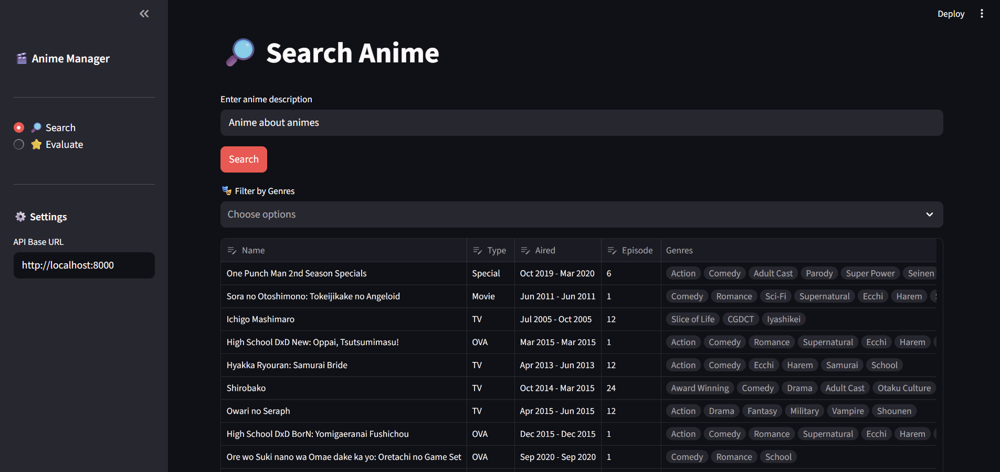

# 🌟 Anime Recommender System  
### 🔍 Find the Right Anime – 🎭 Evaluate Anime Quality from Synopsis

---

## 📌 Overview
**Anime Recommender System** is an AI-powered platform that helps users:

- 🔎 **Search for anime** based on semantic similarity.  
- 🎯 **Predict the quality tier** of an anime (Top-tier / Worthwhile / Watchable / Terrible) using synopsis and genres.

The system integrates **vector databases**, **ML models**, and **LLM reasoning** to produce accurate and natural responses.

---

## 📂 Project Structure

```
ANIME RECOMMENDATION SYSTEM/
│
├── Backend/
│   ├── anime_model
│   ├── database/
│   ├── services/
│   ├── main.py                # for running backend application
│   └── requirements.txt
│
├── Frontend/
│   ├── main.py                # for running frontend web interface
│   ├── Dockerfile
│   ├── requirements.txt

├── Data & Model Preparation/
│   ├── model_training/        # for training evaluation model
│   ├── qdrant_loader/         # load essential data in qdrant database
│   ├── retrieve_preprocessing # retrieve data for training
│   ├── training_data          # used training data
│
├── Images/                 # Documentation and workflow images
│
├── docker-compose.yml
└── README.md
```

---


## 🛠️ 1. Data Retrieval & Preprocessing

### 📥 Data Crawling
- Collected anime metadata and user reviews from public databases (e.g., MyAnimeList).  
- Only anime with **≥ 100,000 user ratings** were kept to ensure data reliability.

### 🧹 Preprocessing
Each anime entry includes:

- ✏️ Title  
- 📖 Synopsis  
- 🏷️ Genres  
- ⭐ Score / Rating  
- 🏆 **Quality Label**: Top-tier, Worthwhile, Watchable, or Terrible  
  (derived from normalized score distribution)

### 🗄️ Storage
- Cleaned and structured data is stored in **PostgreSQL** for efficient access.

---

## 🔎 2. Anime Semantic Search

### 🎯 Goal
Return anime that semantically match the user’s input description.

### 📦 Vector Database
- Generate embeddings from anime synopsis using **Gemini Embedding**.  
- Store embeddings inside **Qdrant** for semantic vector search.

### 📌 Result
Users enter a description → system returns:

- Closest-matching anime  
- Their synopsis & genres  
- Link to MyAnimeList  

### 🌐 Deployment  
Exposed via FastAPI endpoint:

```bash
POST /anime/search
```

## 🤖 3. Model Training & Anime Evaluation

### 🧠 Embedding  
- Use **Gemini Embedding** to encode (synopsis + genres).  
- Embeddings capture tone, narrative structure, and genre patterns.

### 🎓 Classifier  
- Logistic Regression or MLP classifier trained on embedding vectors.  
- Train/Test split: 70/30  
- **Accuracy:** ~0.60 (train), ~0.45 (test) — strong baseline for limited data.

### 🌐 Deployment  
Exposed via FastAPI endpoint:

```bash
POST /anime/evaluate
```


Prediction pipeline:

1. Embed the input text  
2. Classifier predicts the label  
3. LLM (Gemini) generates a natural explanation/comment  

---

## 🖥️ 4. Web Interface
- Built with **Streamlit**  
- Provides two main features:  
---
  - 🔍 Anime Semantic Search  
  

---
  - 🏷️ Anime Quality Evaluation  
  
---

## 📚 References

### 🔧 Technologies Used
- [LangChain](https://github.com/langchain-ai/langchain)  
- [FastAPI](https://github.com/tiangolo/fastapi)  
- [Qdrant Vector Database](https://github.com/qdrant/qdrant)  
- [PostgreSQL](https://github.com/postgres/postgres)

### 📖 Papers & Articles
- *Retrieval-Augmented Generation for Knowledge-Intensive NLP Tasks*  
- *Semantic Search with Vector Databases*

---

## 👤 Credits
Project created by **[Truong Cong Gia Phat](https://github.com/gphat0209)**.

---

## 📝 License
Distributed under the **MIT License**.


